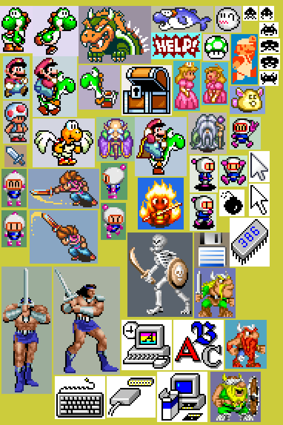
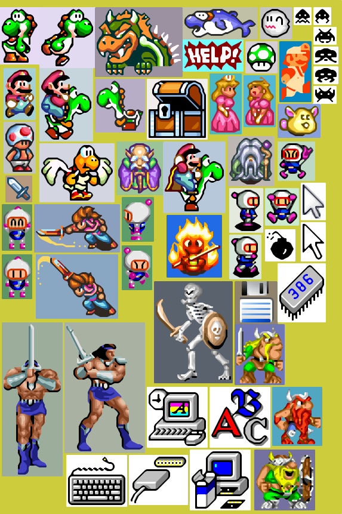
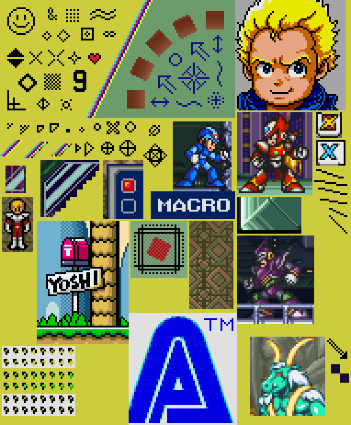
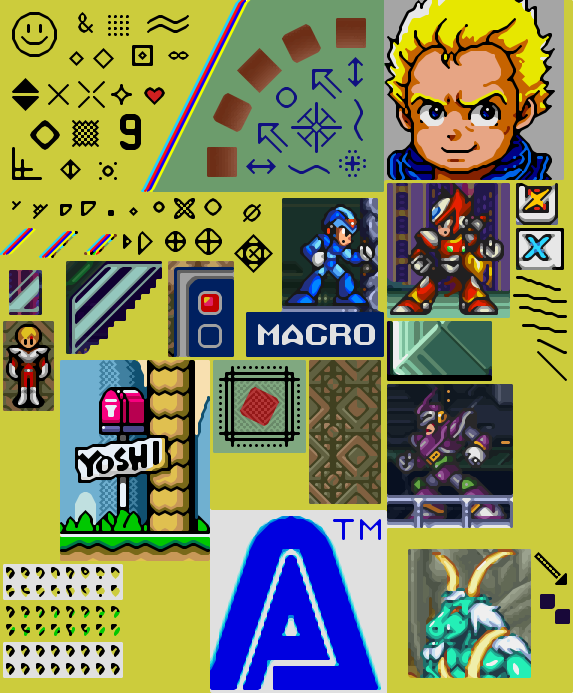

# xbrz-rs


This project is a Rust port of the C++ implementation of the xBRZ pixel scaling algorithm, originally created by Zenju.
You can download the original C++ version on [SourceForge](https://sourceforge.net/projects/xbrz/).
Both the C++ version and this port are licensed under
the [GNU General Public License v3](https://www.gnu.org/licenses/gpl-3.0).

See the [example images](#example-images) section for a comparison of this library's output with nearest neighbour
scaling.

# Usage

There is currently one public function called `scale_rgba`, which can scale an RGBA format image from 2x up to 6x the
original resolution:

```rust
use std::path::Path;

fn upscale_image(input_path: &Path, output_path: &Path, factor: usize) -> Result<(), image::ImageError> {
    let in_image = image::open(input_path)?;

    let width = in_image.width();
    let height = in_image.height();

    let rgba = image::RgbaImage::from(in_image);
    let out_rgba = xbrz::scale_rgba(
        &rgba,
        width as usize,
        height as usize,
        factor
    );

    let out_width = width * factor as u32;
    let out_height = height * factor as u32;

    image::save_buffer(
        output_path,
        &out_rgba,
        out_width,
        out_height,
        image::ExtendedColorType::Rgba8,
    )
}

```

# Features

To compare pixels, the RGB values are converted into YCbCr representation. To do this efficiently, this package creates
a lookup table (LUT) which converts between an RGB difference and scalar difference computed with YCbCr coordinates.

By default, this lookup table uses compressed 5-bit per channel indices such that the LUT only uses 128 KiB of memory.
However, by enabling the `large_lut` feature, the full range of 8-bit differences is used, which causes the LUT to
take up 64 MiB of memory. The difference will be negligible, but you may enable it if you wish for higher accuracy.

# Example images

Also see the [test/images](./test/images) directory for examples at more scaling factors.

## Sample I

|                            Nearest Neighbour x3                             |                   xBRZ algorithm (xbrz-rs) x3                    |
|:---------------------------------------------------------------------------:|:----------------------------------------------------------------:|
|  |  |

## Sample II

|                            Nearest Neighbour x3                             |                   xBRZ algorithm (xbrz-rs) x3                    |
|:---------------------------------------------------------------------------:|:----------------------------------------------------------------:|
|  |  |

## Yoshi

|                         Nearest Neighbour x6                         |                xBRZ algorithm (xbrz-rs) x6                |
|:--------------------------------------------------------------------:|:---------------------------------------------------------:|
|  |  |
